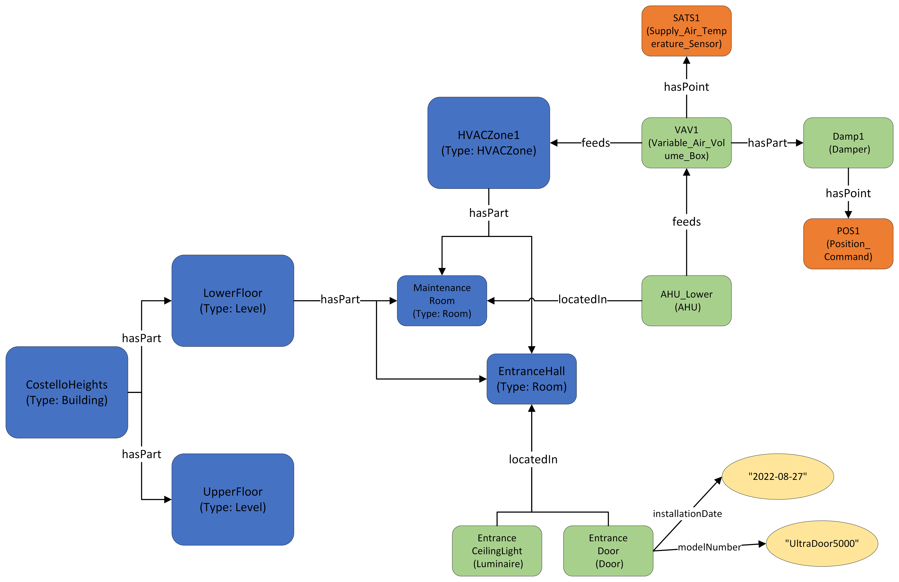

This guide continues building on our previous [Spatial](../spatial/) and [Sensor](../sensor/) modelling guides; to get the most out of it, please skim those guides first. The guide also borrows heavily from our friends at the [Brick Schema](https://docs.brickschema.org/) consortium, and [their guide describing HVAC systems](https://docs.brickschema.org/modeling/collections.html).

In this continued scenario, the owner of the *Costello Heights* building wants their digital twin to include assets mounted inside the building. This includes equipment mounted in public areas, to keep track of installation and replacement dates, model and serial numbers, staff responsible for installation/maintenance, etc; but also HVAC equipment that service the building, and the interconnections between that equipment. The latter might enable automation of settings and other operations, and also allows querying for which areas will be affected by maintenance work and other disruptions.

For simplicity, the scenario is very small; it consists of:

* one door and one luminarie in the main entrance hall of the building
* one HVAC Air Handling Unit feeding a Variable Air Volume (VAV) box, in turn feeding air into an HVAC zone covering the public and maintenance spaces in the building.

## Types used

In addition to the types from the previous two guides, this modelling task will include:

* [Asset](/ontology/Asset/Asset)
    * [Equipment](/ontology/Asset/Equipment/Equipment)
        * [Lighting Equipment](/ontology/Asset/Equipment/Lighting_Equipment/Lighting_Equipment) > [Lighting](/ontology/Asset/Equipment/Lighting_Equipment/Lighting/Lighting) > [Luminaire](/ontology/Asset/Equipment/Lighting_Equipment/Lighting/Luminaire)
        * [HVAC Equipment](/ontology/Asset/Equipment/HVAC_Equipment/HVAC_Equipment)
            * [AHU](/ontology/Asset/Equipment/HVAC_Equipment/AHU/AHU)
            * [Terminal_Unit](/ontology/Asset/Equipment/HVAC_Equipment/Terminal_Unit/Terminal_Unit) > [Variable_Air_Volume_Box](/ontology/Asset/Equipment/HVAC_Equipment/Terminal_Unit/Variable_Air_Volume_Box/Variable_Air_Volume_Box)
            * [Damper](/ontology/Asset/Equipment/HVAC_Equipment/Damper/Damper)
    * [Architectural Asset](/ontology/Asset/ArchitecturalAsset/ArchitecturalAsset) > [Barrier Asset](/ontology/Asset/ArchitecturalAsset/BarrierAsset/BarrierAsset) > [Door](/ontology/Asset/ArchitecturalAsset/BarrierAsset/Door)
* [Space](/ontology/Space/Space)
    * [Architecture](/ontology/Space/Architecture/Architecture) > [Zone](/ontology/Space/Architecture/Zone/Zone) > [HVACZone](/ontology/Space/Architecture/Zone/HVACZone)
* [Point](/ontology/Point/Point)
    * [Sensor](/ontology/Point/Sensor/Sensor) > [Temperature_Sensor](/ontology/Point/Sensor/Temperature_Sensor/Temperature_Sensor) > [Air Temperature Sensor](/ontology/Point/Sensor/Temperature_Sensor/Air_Temperature_Sensor/Air_Temperature_Sensor) > [Supply Air Temperature Sensor](/ontology/Point/Sensor/Temperature_Sensor/Air_Temperature_Sensor/Supply_Air_Temperature_Sensor/Supply_Air_Temperature_Sensor)
    * [Command](/ontology/Point/Command/Command) > [Position Command](/ontology/Point/Command/Position_Command/Position_Command)

## Relationships and Properties used

In addition to the Relationships and Properties that were already used in the previous guides, we now add:

* [Asset](/ontology/Asset/Asset).locatedIn -- Placing Assets, whether equipment systems or individual furniture/architectural assets, into the spatial topology. In this case, used to represent the placement of the door, luminarie, and AHU.
* [Asset](/ontology/Asset/Asset).hasPart -- Used to represent parthood within an Asset; in this case, that a VAV box contains within it a specific Damper.
* [Equipment](/ontology/Asset/Equipment/Equipment).feeds -- Used to describe interconnectedness of Equipment with other Equipment and with Spaces in the building; in this case, the feeding of air from an AHU through a VAV box and into a designated HVAC zone.

### Properties

* [Asset](/ontology/Asset/Asset).installationDate
* [Asset](/ontology/Asset/Asset).modelNumber

## Graphical representation



## RDF triples representation (SHACL models)

[Download TTL file](assets_hvac.ttl)

```
# Namespaces
@prefix rdf: <http://www.w3.org/1999/02/22-rdf-syntax-ns#> .
@prefix rec: <https://w3id.org/rec#> .
@prefix brick: <https://brickschema.org/schema/Brick#> .
@prefix xsd: <http://www.w3.org/2001/XMLSchema#> .
@prefix : <https://example.com#> .

# Type declarations.
# Spaces
:CostelloHeights    rdf:type        rec:Building        .
:LowerFloor         rdf:type        rec:Level           .
:UpperFloor         rdf:type        rec:Level           .
:EntranceHall       rdf:type        rec:Room            .
:MaintenanceRoom    rdf:type        rec:Room            .
:HVACZone1          rdf:type        rec:HVACZone        .

# Assets
:EntranceCeilingLight   rdf:type    brick:Luminarie     .
:EntranceDoor           rdf:type    rec:Door            .
:AHU_Lower              rdf:type    brick:AHU           .
:VAV1                   rdf:type    brick:Variable_Air_Volume_Box   .
:Damp1                  rdf:type    brick:Damper        .

# Spatial topology
:CostelloHeights    rec:hasPart     :LowerFloor         .
:CostelloHeights    rec:hasPart     :UpperFloor         .
:LowerFloor         rec:hasPart     :EntranceHall       .
:LowerFloor         rec:hasPart     :MaintenanceRoom    .
:HVACZone1          rec:hasPart     :EntranceHall       .
:HVACZone1          rec:hasPart     :MaintenanceRoom    .

# Asset placement
:EntranceCeilingLight   rec:locatedIn      :EntranceHall      .
:EntranceDoor           rec:locatedIn      :EntranceHall      .
:AHU_Lower              rec:locatedIn      :MaintenanceRoom   .

# Equipment feeds and parthood
:AHU_Lower  brick:feeds     :VAV1       .
:VAV1       brick:feeds     :HVACZone1  .
:VAV1       rec:hasPart     :Damp1      .

# Points
:SATS1      rdf:type            brick:Supply_Air_Temperature_Sensor .
:POS1       rdf:type            brick:Position_Command              .
:VAV1       brick:hasPoint      :SATS1                              .
:Damp1      brick:hasPoint      :POS1                               .

# Door values
:EntranceDoor     rec:installationDate   "2022-08-27"^^xsd:date         .
:EntranceDoor     rec:modelNuber         "UltraDoor5000"^^xsd:string    .
```


## Azure Digital Twins JSON representation (DTDL models)

[Download JSON file](assets_hvac.json)

```
{
    "digitalTwinsFileInfo": {
        "fileVersion": "1.0.0"
    },
    "digitalTwinsGraph": {
        "digitalTwins": [
            {
                "$dtId": "CostelloHeights",
                "$etag": "W/\"ee7f9ac5-cde8-482e-9f3f-de4b3da170f8\"",
                "geometry": "[[14.16, 57.77], ... , [14.16, 57.77]]",
                "$metadata": {
                    "$model": "dtmi:org:w3id:rec:Building;1"
                }
            },
            {
                "$dtId": "UpperFloor",
                "$etag": "W/\"3d904969-d842-4bf0-b1f6-7ff6b687460c\"",
                "levelNumber": 2,
                "$metadata": {
                    "$model": "dtmi:org:w3id:rec:Level;1"
                }
            },
            {
                "$dtId": "LowerFloor",
                "$etag": "W/\"459c63ee-04d7-4031-91fb-e50e64a5d8b4\"",
                "levelNumber": 1,
                "geometry": "[[0.5, 0.5], ... , [15.5, 15.5]]",
                "$metadata": {
                    "$model": "dtmi:org:w3id:rec:Level;1"
                }
            },
            {
                "$dtId": "AHU_Lower",
                "$etag": "W/\"27be5719-9698-481d-baab-7933f9f0df19\"",
                "$metadata": {
                    "$model": "dtmi:org:brickschema:schema:Brick:AHU;1"
                }
            },
            {
                "$dtId": "MaintenanceRoom",
                "$etag": "W/\"a6d63da0-df6a-48d3-ab4c-047d792265b6\"",
                "$metadata": {
                    "$model": "dtmi:org:w3id:rec:Room;1"
                }
            },
            {
                "$dtId": "EntranceHall",
                "$etag": "W/\"33356145-00fa-4632-82b8-5d197821f58d\"",
                "$metadata": {
                    "$model": "dtmi:org:w3id:rec:Room;1"
                }
            },
            {
                "$dtId": "EntranceCeilingLight",
                "$etag": "W/\"5f80ef22-9156-4225-b064-70b37cc27f8e\"",
                "$metadata": {
                    "$model": "dtmi:org:brickschema:schema:Brick:Luminaire;1"
                }
            },
            {
                "$dtId": "VAV1",
                "$etag": "W/\"84e5c26d-d70b-4ca3-9257-252589cc9502\"",
                "$metadata": {
                    "$model": "dtmi:org:brickschema:schema:Brick:Variable_Air_Volume_Box;1"
                }
            },
            {
                "$dtId": "Damp1",
                "$etag": "W/\"6f182c1e-9f60-4242-834d-0f5325df0f81\"",
                "$metadata": {
                    "$model": "dtmi:org:brickschema:schema:Brick:Damper;1"
                }
            },
            {
                "$dtId": "HVACZone1",
                "$etag": "W/\"d61f2477-c3f4-4995-a65d-85871bf99529\"",
                "$metadata": {
                    "$model": "dtmi:org:w3id:rec:HVACZone;1"
                }
            },
            {
                "$dtId": "EntranceDoor",
                "$etag": "W/\"977675cc-4317-4ce8-9c6b-2b8c8933cc24\"",
                "installationDate": "2022-08-27",
                "modelNumber": "UltraDoor5000",
                "$metadata": {
                    "$model": "dtmi:org:w3id:rec:Door;1"
                }
            },
            {
                "$dtId": "POS1",
                "$etag": "W/\"85cd4899-f8ae-45c8-bce0-5d21f01c1c59\"",
                "$metadata": {
                    "$model": "dtmi:org:brickschema:schema:Brick:Position_Command;1"
                }
            },
            {
                "$dtId": "SATS1",
                "$etag": "W/\"ee751e9c-51c9-4aa4-89b7-6bfd57522fdc\"",
                "$metadata": {
                    "$model": "dtmi:org:brickschema:schema:Brick:Supply_Air_Temperature_Sensor;1"
                }
            }
        ],
        "relationships": [
            {
                "$relationshipId": "6fea7ce8-1827-4d6f-8773-dc42ffd124b5",
                "$sourceId": "CostelloHeights",
                "$targetId": "UpperFloor",
                "$relationshipName": "hasPart",
                "$etag": "W/\"fbbb0925-b5a2-4221-ad4e-4eb45e6311ef\""
            },
            {
                "$relationshipId": "5451cb07-4a2c-4b0e-b2f8-a81f777e85c6",
                "$sourceId": "CostelloHeights",
                "$targetId": "LowerFloor",
                "$relationshipName": "hasPart",
                "$etag": "W/\"99b9f7b6-a150-4923-952f-f08f14bf08be\""
            },
            {
                "$relationshipId": "7edb081a-9d5a-4a07-bbd9-5b84e635ff15",
                "$sourceId": "LowerFloor",
                "$targetId": "MaintenanceRoom",
                "$relationshipName": "hasPart",
                "$etag": "W/\"ed870e68-37bf-46c4-ae25-08b5aa6fdaf9\""
            },
            {
                "$relationshipId": "c55efa4c-6ab4-492a-8c62-a58d9e7d1ffd",
                "$sourceId": "LowerFloor",
                "$targetId": "EntranceHall",
                "$relationshipName": "hasPart",
                "$etag": "W/\"6f076239-1eb0-45dc-804b-ad069904dfa9\""
            },
            {
                "$relationshipId": "39a33709-abfc-4e7c-9fe5-c5490f276287",
                "$sourceId": "AHU_Lower",
                "$targetId": "MaintenanceRoom",
                "$relationshipName": "locatedIn",
                "$etag": "W/\"93efd1db-3c19-4a16-99b0-28bd11c91a1a\""
            },
            {
                "$relationshipId": "91023d35-55f2-4398-8059-ce7e9c5a6d85",
                "$sourceId": "AHU_Lower",
                "$targetId": "VAV1",
                "$relationshipName": "feeds",
                "$etag": "W/\"4233f1eb-62aa-4227-a72c-b3b5709b0633\""
            },
            {
                "$relationshipId": "53b2f9ad-6da7-4f6d-a453-36f7f73f76ab",
                "$sourceId": "Damp1",
                "$targetId": "POS1",
                "$relationshipName": "hasPoint",
                "$etag": "W/\"be8c7168-c034-44ca-8c81-e634e575b172\""
            },
            {
                "$relationshipId": "53933323-e299-4bf7-9495-c2af39cd890b",
                "$sourceId": "VAV1",
                "$targetId": "SATS1",
                "$relationshipName": "hasPoint",
                "$etag": "W/\"7f2e1c4c-5c10-479b-8f71-63ad96a7a996\""
            },
            {
                "$relationshipId": "1d5d2e5b-c0c5-480c-8048-cc3074541107",
                "$sourceId": "HVACZone1",
                "$targetId": "EntranceHall",
                "$relationshipName": "hasPart",
                "$etag": "W/\"81f77c68-0791-4430-a4fc-c67add5457b4\""
            },
            {
                "$relationshipId": "5d5c63ff-1447-4dc5-91f5-5eb7ca35597f",
                "$sourceId": "HVACZone1",
                "$targetId": "MaintenanceRoom",
                "$relationshipName": "hasPart",
                "$etag": "W/\"fb8e6fac-8fc7-45b6-bc83-4fdf417cdcbc\""
            },
            {
                "$relationshipId": "44631f88-9bcd-4b14-ada6-ac6128849d0c",
                "$sourceId": "VAV1",
                "$targetId": "Damp1",
                "$relationshipName": "hasPart",
                "$etag": "W/\"e38a224c-8184-4334-80a5-a74efcbc6167\""
            },
            {
                "$relationshipId": "0732aa9d-0e62-4551-9609-2102e14b8888",
                "$sourceId": "VAV1",
                "$targetId": "HVACZone1",
                "$relationshipName": "feeds",
                "$etag": "W/\"e6e63b6f-c63a-4d1c-a71a-4d360e0bdf57\""
            },
            {
                "$relationshipId": "fadee291-9a9d-4c28-994f-197d6554bb13",
                "$sourceId": "EntranceDoor",
                "$targetId": "EntranceHall",
                "$relationshipName": "locatedIn",
                "$etag": "W/\"196b27e3-2252-4110-a8bb-2ef8201ceb31\""
            },
            {
                "$relationshipId": "7fe43a8d-b434-4c2e-807c-9af14f67f788",
                "$sourceId": "EntranceCeilingLight",
                "$targetId": "EntranceHall",
                "$relationshipName": "locatedIn",
                "$etag": "W/\"9abdead8-a12a-4477-a81c-9e9364d781bd\""
            }
        ]
    }
}
```