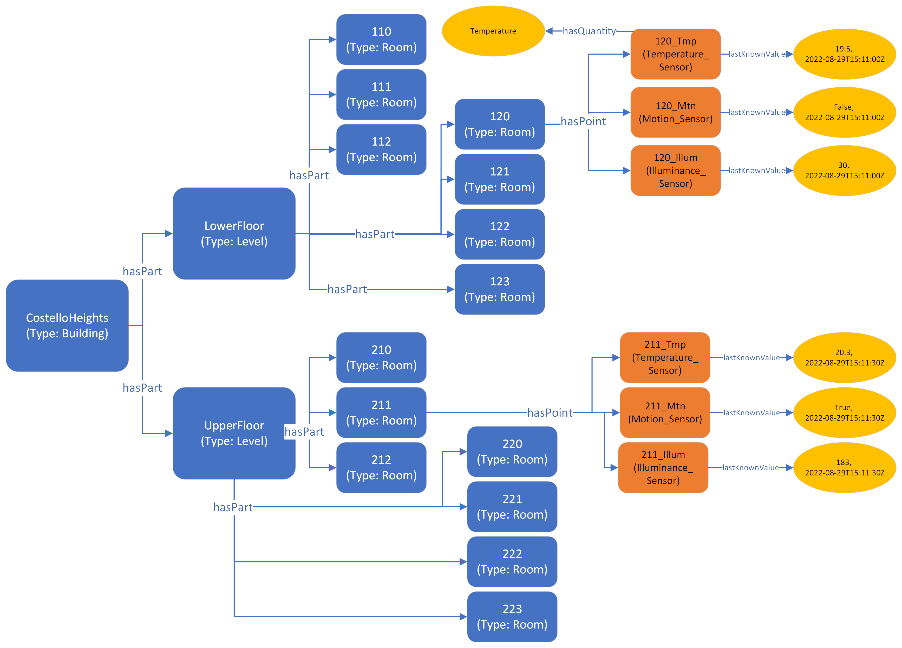

Building on the [spatial modelling guide](../spatial/), the customer now wishes their digital twin to include sensors and sensor readings coming in from equipment mounted in the *Costello Heights* building. To this end, they've fitted the building with sensors that measure temperature, motion, and light level (e.g., a Philips Hue motion sensor). 

Note that the onboarding of such a sensor system and the ingestion of data from it are outside of scope of this guide; we focus on how to represent the sensors using RealEstateCore.

## Types used

* [Point](/ontology/Point/Point)
    * [Sensor](/ontology/Point/Sensor/Sensor)
        * [Temperature_Sensor](/ontology/Point/Sensor/Temperature_Sensor/Temperature_Sensor)
        * [Motion_Sensor](/ontology/Point/Sensor/Motion_Sensor/Motion_Sensor)
        * [Illuminance_Sensor](/ontology/Point/Sensor/Illuminance_Sensor/Illuminance_Sensor)
* [Space](/ontology/Space/Space)
    * [Architecture](/ontology/Space/Architecture)
        * [Building](/ontology/Space/Architecture/Building)
        * [Level](/ontology/Space/Architecture/Level)
        * [Room](/ontology/Space/Architecture/Room/Room)

The *Space*, *Architecture*, *Point*, and *Sensor* types are not explicitly instantiated in the solution; they are included here as they define relationships and properties (see below) that are inherited by their subtypes and which are used.

## Relationships and Properties used

* [Space](/ontology/Space/Space).hasPart
* [Space](/ontology/Space/Space).hasPoint

This example simply adds Brick points to the spatial topology, using the *hasPoint* relationship. Each point is of a specific type, indicating what it measures. Note that points can be added to any spaces, not only rooms; so, e.g., computed points such as aggregations could be assigned directly to buildings.

### Properties

* [Point](/ontology/Point/Point).lastKnownValue
* [Point](/ontology/Point/Point).hasQuantity	(optional)

*lastKnownValue* allows the digital twin to represent the most recently ingested reading from a *Sensor* (or payload sent to a *Command*). In most analytics scenarios, these values would be streamed into a time series database, either directly from the sensor framework, or after having been set on the digital twin node. *lastKnownValue* has a data schema consisting of a string (representing the sensor value) and a timestamp (representing when the sensor reading was made). 

If one wants to make the type of measurement that a sensor provides even more explicit, the Point.hasQuantity property can be employed; it has an enumeration schema listing a variety of measurable quantities of interest, e.g., *Temperature*, *Illuminance*, etc. This would allow queries to be posed to the digital twin platform not only based on point typing, but also based on such quantity types.

Note that as of this writing, REC DTDL does not support defining sensor units in the knowledge graph. REC SHACL (and specifically Brick Schema) allows for QUDT units to be assigned to points. We are investigating how to best implement adjustable unit support in DTDL.

## Graphical representation



## RDF triples representation (SHACL models)

[Download TTL file](sensor.ttl)

```
# Type declarations. Note: some rooms from illustration
# ommited for brevity
:CostelloHeights    rdf:type        rec:Building        .
:LowerFloor         rdf:type        rec:Level           .
:UpperFloor         rdf:type        rec:Level           .
:120                rdf:type        rec:Room            .
:211                rdf:type        rec:Room            .

# Sensors
:120_Tmp            rdf:type        brick:Temperature_Sensor    .
:120_Mtn            rdf:type        brick:Motion_Sensor         .
:120_Illum          rdf:type        brick:Illuminance_Sensor    .
:211_Tmp            rdf:type        brick:Temperature_Sensor    .
:211_Mtn            rdf:type        brick:Motion_Sensor         .
:211_Illum          rdf:type        brick:Illuminance_Sensor    .

# Sensor placement
:120                brick:hasPoint      :120_Tmp      .
:120                brick:hasPoint      :120_Mtn      .
:120                brick:hasPoint      :120_Illum    .
:211                brick:hasPoint      :211_Tmp      .
:211                brick:hasPoint      :211_Mtn      .
:211                brick:hasPoint      :211_Illum    .

# Values
:120_Tmp            brick:lastKnownValue [
    brick:value         "19.5";
    brick:timestamp     "2022-08-29T15:11:00Z"
] .
:120_Mtn            brick:lastKnownValue [
    brick:value         "false";
    brick:timestamp     "2022-08-29T15:11:00Z"
] .
:120_Illum            brick:lastKnownValue [
    brick:value         "30";
    brick:timestamp     "2022-08-29T15:11:00Z"
] .
:211_Tmp            brick:lastKnownValue [
    brick:value         "20.3";
    brick:timestamp     "2022-08-29T15:11:30Z"
] .
:211_Mtn            brick:lastKnownValue [
    brick:value         "true";
    brick:timestamp     "2022-08-29T15:11:30Z"
] .
:211_Illum            brick:lastKnownValue [
    brick:value         "183";
    brick:timestamp     "2022-08-29T15:11:30Z"
] .
```

## Azure Digital Twins JSON representation (DTDL models)

[Download JSON file](spatial.json)

```
{
  "digitalTwinsFileInfo": {
    "fileVersion": "1.0.0"
  },
  "digitalTwinsGraph": {
    "digitalTwins": [
      {
        "$dtId": "120",
        "$etag": "W/\"d1db10f1-a098-4c5d-8e2f-092e8c11f418\"",
        "geometry": "[[4.0, 2.5], ... , [4.0, 2.5]]",
        "$metadata": {
          "$model": "dtmi:org:w3id:rec:Room;1"
        }
      },
      {
        "$dtId": "211",
        "$etag": "W/\"a6fd1495-f58e-4591-99fd-9bf7eacb92c4\"",
        "$metadata": {
          "$model": "dtmi:org:w3id:rec:Room;1"
        }
      },
      {
        "$dtId": "211_Tmp",
        "$etag": "W/\"b58fb532-0d8f-493f-9ac6-f3577a1780ee\"",
        "lastKnownValue": {
          "timestamp": "2022-08-29T15:55:29",
          "value": "20.3"
        },
        "$metadata": {
          "$model": "dtmi:org:brickschema:schema:Brick:Temperature_Sensor;1"
        }
      },
      {
        "$dtId": "120_Tmp",
        "$etag": "W/\"a5d93531-3d62-46ac-ae72-b775d5866a21\"",
        "lastKnownValue": {
          "timestamp": "2022-08-29T15:54:11",
          "value": "19.5"
        },
        "$metadata": {
          "$model": "dtmi:org:brickschema:schema:Brick:Temperature_Sensor;1"
        }
      },
      {
        "$dtId": "211_Mtn",
        "$etag": "W/\"f621f1a9-d99c-4a6d-97c1-4ffc025805ab\"",
        "lastKnownValue": {
          "timestamp": "2022-08-29T15:55:46",
          "value": "true"
        },
        "$metadata": {
          "$model": "dtmi:org:brickschema:schema:Brick:Motion_Sensor;1"
        }
      },
      {
        "$dtId": "120_Mtn",
        "$etag": "W/\"e399e478-95ad-4d91-af56-9b1b4542213b\"",
        "lastKnownValue": {
          "timestamp": "2022-08-29T15:54:36",
          "value": "false"
        },
        "$metadata": {
          "$model": "dtmi:org:brickschema:schema:Brick:Motion_Sensor;1"
        }
      },
      {
        "$dtId": "120_Illum",
        "$etag": "W/\"700b90d2-a97f-44ad-b33a-41629f895c41\"",
        "lastKnownValue": {
          "timestamp": "2022-08-29T15:55:11",
          "value": "30"
        },
        "$metadata": {
          "$model": "dtmi:org:brickschema:schema:Brick:Illuminance_Sensor;1"
        }
      },
      {
        "$dtId": "211_Illum",
        "$etag": "W/\"83241a33-8e50-47b9-90fb-918d656337f7\"",
        "lastKnownValue": {
          "timestamp": "2022-08-29T15:55:57",
          "value": "183"
        },
        "$metadata": {
          "$model": "dtmi:org:brickschema:schema:Brick:Illuminance_Sensor;1"
        }
      }
    ],
    "relationships": [
      {
        "$relationshipId": "333444db-94d6-4ef1-a313-f4763229c5e9",
        "$sourceId": "120",
        "$targetId": "120_Tmp",
        "$relationshipName": "hasPoint",
        "$etag": "W/\"8cd3f78e-0eae-404f-8746-81f35c1a7cc5\""
      },
      {
        "$relationshipId": "51131891-217c-4601-a327-11baeca22599",
        "$sourceId": "120",
        "$targetId": "120_Mtn",
        "$relationshipName": "hasPoint",
        "$etag": "W/\"2624d58a-a00f-48a2-9cdb-f01f502cdae0\""
      },
      {
        "$relationshipId": "c3aa185c-47a7-47dd-92e1-adee4540ef27",
        "$sourceId": "120",
        "$targetId": "120_Illum",
        "$relationshipName": "hasPoint",
        "$etag": "W/\"8058b20e-58c4-4422-b1ba-b3bcb1d4bdd3\""
      },
      {
        "$relationshipId": "37a16292-d4e9-4d1c-b27d-dd0324d63f9b",
        "$sourceId": "211",
        "$targetId": "211_Tmp",
        "$relationshipName": "hasPoint",
        "$etag": "W/\"4632718c-43ec-4678-9b8d-77972396b364\""
      },
      {
        "$relationshipId": "869499a5-d2e9-461f-8b2e-bada632146b0",
        "$sourceId": "211",
        "$targetId": "211_Mtn",
        "$relationshipName": "hasPoint",
        "$etag": "W/\"144b35a3-c616-4d30-980a-7a28a58d255b\""
      },
      {
        "$relationshipId": "f6617a73-d14e-4cb2-8d78-5cd13837bc3c",
        "$sourceId": "211",
        "$targetId": "211_Illum",
        "$relationshipName": "hasPoint",
        "$etag": "W/\"9d7ef9d2-6157-49c0-a3f5-168ae470ae0b\""
      }
    ]
  }
}
```