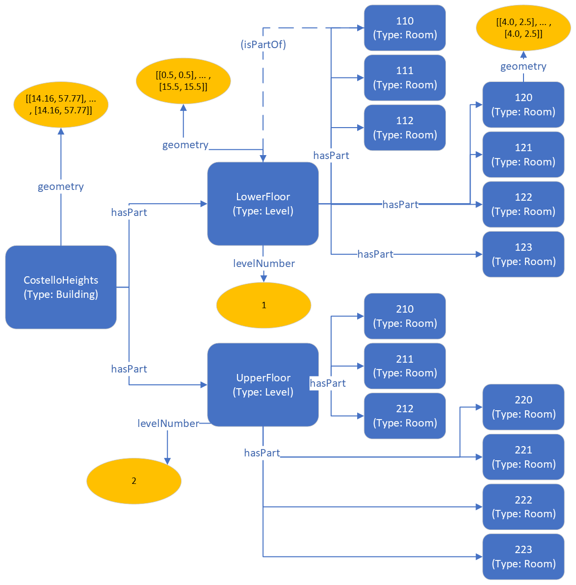

## Scenario

The customer wants to be able to describe the layout of their building *Costello Heights* in a digital twin platform, for purposes of spatially placing sensor readings, equipment commands, etc., such that this placement can be used to guide analytics and visualization. They also want to be able to place the building on a map in, e.g., OpenStreetMaps. 

For the sake of this guide, we exemplify using a two-story building containing four apartments. Note that the apartments are not explicitly modelled in this example, as they are administrative rather than spatial constructs; but if needed, REC provides an Apartment type for such a scenario.

## Types used

* [Space](/ontology/Space/Space)
    * [Architecture](/ontology/Space/Architecture/Architecture)
        * [Building](/ontology/Space/Architecture/Building/Building)
        * [Level](/ontology/Space/Architecture/Level/Level)
        * [Room](/ontology/Space/Architecture/Room/Room)

The *Space* and *Architecture* types are not explicitly instantiated in the solution; they are included here as they define relationships (see below) that are inherited by their subtypes and which are used.

## Relationships and Properties used

### Relationships

* [Space](/ontology/Space/Space).hasPart
* [Space](/ontology/Space/Space).isPartOf (optional)

In this example we are modelling the spatial topology from the parent (surrounding) space to the child (included) space, using the *hasPart* relationship. Most graph storage and query engines allow traversal of such links in either direction, but if for some reason it is important to explicitly model the inverse directionality (child to parent), *isPartOf* can be used instead, or as a complement. If both directions are defined simultanously, for consistency, make sure that any updates are applied to both. For the sake of brevity, in the illustration and code below, only one *isPartOf* link is displayed. 

### Properties

* [Level](/ontology/Space/Architecture/Level/Level).levelNumber
* [Space](/ontology/Space/Space).geometry

The *geometry* property is used to declare the actual geometry of the spaces in question. If spatial modelling is employed only for topological purposes (e.g., to cluster sensors or spaces that are part of the same floor, room, etc), then geometry may not always be needed; but if the graph is used to generate visualizations, maps, etc., then understanding not only the topology but the actual physical layout of the spaces is of course crucial.

In this example we give a global geometry (Longitude/Latitude) for the CostelloHeights building, but provide local geometries for its contained child spaces. RealEstateCore is not prescriptive in terms of which coordinate systems or measurement units are employed for spatial representation; this depends on your use case.

## Graphical representation



## RDF triples representation (SHACL models)

[Download TTL file](spatial.ttl)

```
# Namespaces
@prefix rdf: <http://www.w3.org/1999/02/22-rdf-syntax-ns#> .
@prefix rec: <https://w3id.org/rec#> .
@prefix : <https://example.com#> .

# Type declarations. Note: some rooms from illustration
# ommited for brevity
:CostelloHeights    rdf:type        rec:Building        .
:LowerFloor         rdf:type        rec:Level           .
:UpperFloor         rdf:type        rec:Level           .
:110                rdf:type        rec:Room            .
:111                rdf:type        rec:Room            .
:120                rdf:type        rec:Room            .
:123                rdf:type        rec:Room            .

# Spatial topology
:CostelloHeights    rec:hasPart     :LowerFloor   .
:CostelloHeights    rec:hasPart     :UpperFloor   .
:LowerFloor         rec:hasPart     :110   .
:LowerFloor         rec:hasPart     :111   .
:UpperFloor         rec:hasPart     :120   .
:UpperFloor         rec:hasPart     :123   .

# Floor numbers
:LowerFloor         rec:levelNumber 1                   .
:UpperFloor         rec:levelNumber 2                   .

# Geometries. Note: full polygons ommited for brevity
:CostelloHeights    rec:geometry    "[[14.16, 57.77], ... , [14.16, 57.77]]" .
:LowerFloor         rec:geometry    "[[0.5, 0.5], ... , [15.5, 15.5]]" .
:120                rec:geometry    "[[4.0, 2.5], ... , [4.0, 2.5]]" .
```

## Azure Digital Twins JSON representation (DTDL models)

[Download JSON file](spatial.json)

```
{
    "digitalTwinsGraph": {
    "digitalTwins": [
      {
        "$dtId": "CostelloHeights",
        "$etag": "W/\"ee7f9ac5-cde8-482e-9f3f-de4b3da170f8\"",
        "geometry": "[[14.16, 57.77], ... , [14.16, 57.77]]",
        "$metadata": {
          "$model": "dtmi:org:w3id:rec:Building;1"
        }
      },
      {
        "$dtId": "UpperFloor",
        "$etag": "W/\"3d904969-d842-4bf0-b1f6-7ff6b687460c\"",
        "levelNumber": 2,
        "$metadata": {
          "$model": "dtmi:org:w3id:rec:Level;1"
        }
      },
      {
        "$dtId": "LowerFloor",
        "$etag": "W/\"459c63ee-04d7-4031-91fb-e50e64a5d8b4\"",
        "levelNumber": 1,
        "geometry": "[[0.5, 0.5], ... , [15.5, 15.5]]",
        "$metadata": {
          "$model": "dtmi:org:w3id:rec:Level;1"
        }
      },
      {
        "$dtId": "110",
        "$etag": "W/\"4e9d7305-45e9-4375-8ad6-a54214693836\"",
        "$metadata": {
          "$model": "dtmi:org:w3id:rec:Room;1"
        }
      },
      {
        "$dtId": "111",
        "$etag": "W/\"fe3f3008-7ddb-428e-8b24-2486023d329f\"",
        "$metadata": {
          "$model": "dtmi:org:w3id:rec:Room;1"
        }
      },
      {
        "$dtId": "120",
        "$etag": "W/\"d1db10f1-a098-4c5d-8e2f-092e8c11f418\"",
        "geometry": "[[4.0, 2.5], ... , [4.0, 2.5]]",
        "$metadata": {
          "$model": "dtmi:org:w3id:rec:Room;1"
        }
      },
      {
        "$dtId": "123",
        "$etag": "W/\"04afb682-532c-4766-8ac2-250eb361ca62\"",
        "$metadata": {
          "$model": "dtmi:org:w3id:rec:Room;1"
        }
      }
    ],
    "relationships": [
      {
        "$relationshipId": "b39e860c-da8d-43b0-870a-c95f50d55e4b",
        "$sourceId": "UpperFloor",
        "$targetId": "120",
        "$relationshipName": "hasPart",
        "$etag": "W/\"650fece0-bece-41a0-9736-da5e77a026ed\""
      },
      {
        "$relationshipId": "e73425ff-afe3-43d8-97d2-c5405bb5ab44",
        "$sourceId": "UpperFloor",
        "$targetId": "123",
        "$relationshipName": "hasPart",
        "$etag": "W/\"0aefde91-e11e-4320-8ddb-cddaa3750661\""
      },
      {
        "$relationshipId": "53388efc-0a90-4bb0-a6bd-d93d04554106",
        "$sourceId": "LowerFloor",
        "$targetId": "110",
        "$relationshipName": "hasPart",
        "$etag": "W/\"97032cca-9432-498b-82ad-cb682cd82d0f\""
      },
      {
        "$relationshipId": "92d67bf5-7a60-4895-aa4e-13335402b377",
        "$sourceId": "LowerFloor",
        "$targetId": "111",
        "$relationshipName": "hasPart",
        "$etag": "W/\"7c807e6f-53cc-45db-aef7-959d8925d91e\""
      },
      {
        "$relationshipId": "6fea7ce8-1827-4d6f-8773-dc42ffd124b5",
        "$sourceId": "CostelloHeights",
        "$targetId": "UpperFloor",
        "$relationshipName": "hasPart",
        "$etag": "W/\"fbbb0925-b5a2-4221-ad4e-4eb45e6311ef\""
      },
      {
        "$relationshipId": "5451cb07-4a2c-4b0e-b2f8-a81f777e85c6",
        "$sourceId": "CostelloHeights",
        "$targetId": "LowerFloor",
        "$relationshipName": "hasPart",
        "$etag": "W/\"99b9f7b6-a150-4923-952f-f08f14bf08be\""
      }
    ]
  }
}
```
