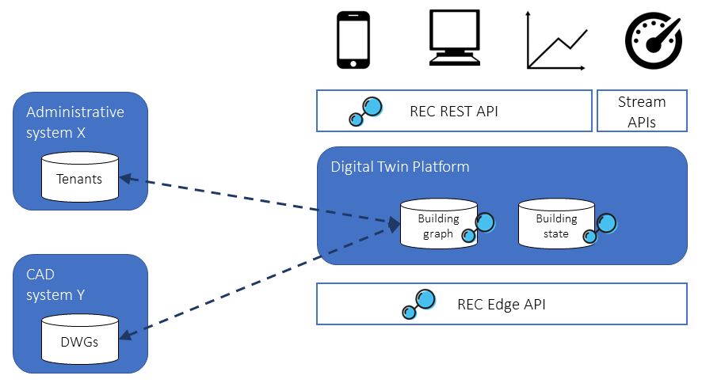

The RealEstateCore project provides software that supports the development and use of RealEstateCore; but we do not (yet) provide a reference system implementation; that, users will have to build or buy themselves. There are several options available on this market, see listing below. If you produce a REC platform and would like to be listed, [please reach out](/community/).

## Ready-made commercial options

* [Idun ProptechOS](https://proptechos.com/)
* [Azure Digital Twins](https://azure.microsoft.com/en-us/services/digital-twins/)
* [WillowTwin](https://www.willowinc.com/product)

## Building a RealEstateCore Platform

Below is a high-level schematic of the architecture for a RealEstateCore platform. 

It includes:

* The southbound data ingestion API, typically constructed on top of a message-passing architecture (e.g., MQTT, IoT Edge), where messages to/from the building systems are transmitted using the [REC Edge Message schema](/docs/API/Edge/). 
* The building graph, describing the topology and features of the building, its equipment, sensors, etc., using REC ontology semantics. The building graph might include references to external systems holding data complementing the building graph, e.g., tenant data, CAD data, etc., which are fetched remotely as needed.
* The building state datastore, updated from sensor readings to set values for digital twins of meters, actuators, etc. In some platforms, this state is stored directly in the aforementioned building graph.
* The northbound client-facing RESTful API, specified per the [REC REST API specification](/docs/API/REST/). This allows for software, analytics platforms, visualizations, etc., to present data from the smart building, and to, provided sufficient authorization, request actuation (setting HVAC setpoints, opening doors, etc). 
* A northbound streaming API: for cases where external analytics engines need to operate directly on the sensor data streams, such a passthrough API can be a powerful complement. At this time REC does not specify such an API.