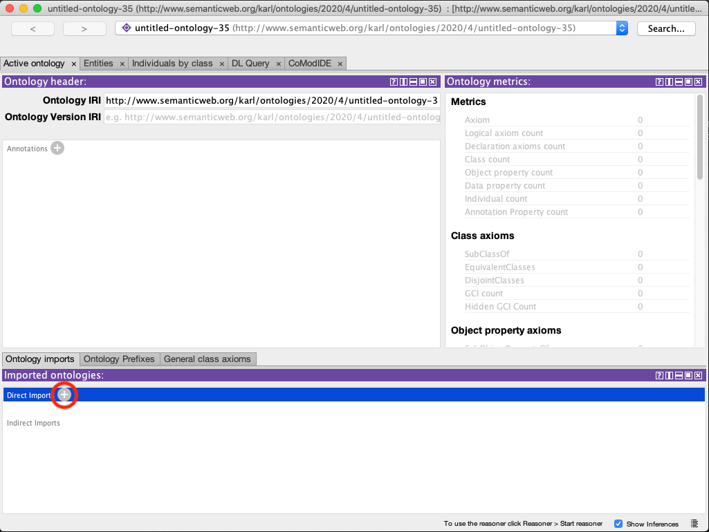
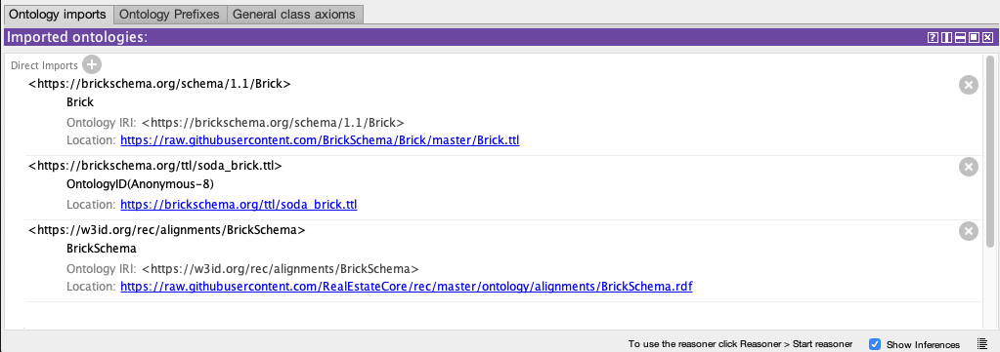
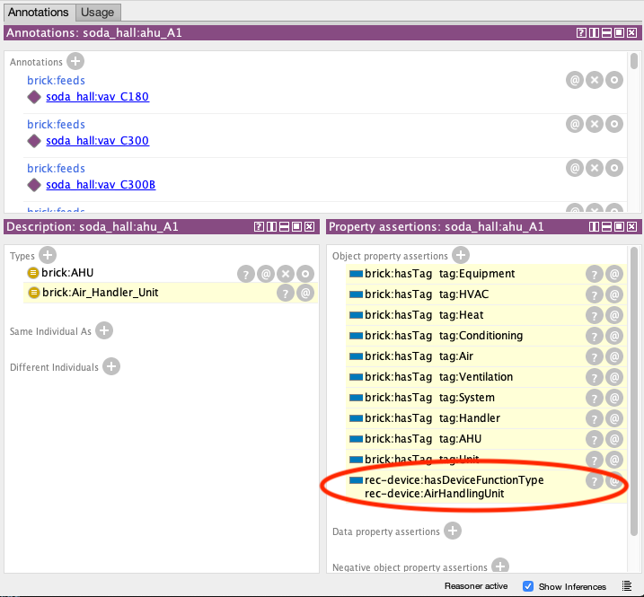
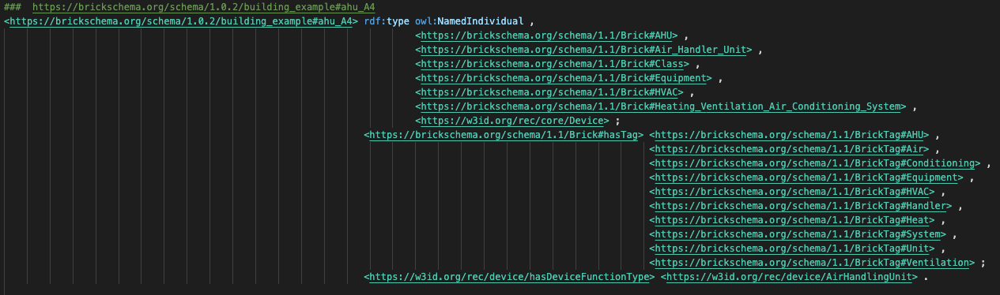

Data that is expressed using the [Brick Schema](https://brickschema.org) can be translated into REC semantics using the official [Brick to REC alignments](https://raw.githubusercontent.com/RealEstateCore/rec/master/ontology/alignments/BrickSchema.rdf) and an OWL reasoner (such as the one provided in the [Protégé](https://protege.stanford.edu) ontology editor). Just follow these steps -- illustrative figures presented below.

**Note** If you find that Protégé becomes unresponsive once you have started the reasoner, you can configure the reasoner to not execute expensive calculations through the `Reasoner`/`Configure...` menu option. In particular, calculating Disjoint Classes in this scenario can be extraordinarily time-consuming, so we recommend that you turn that option off prior to proceeding.

1. Start a new ontology file in Protégé (the namespace doesn't matter).
2. From the Ontology Imports GUI, select to import a new ontology (Figure 1), and import the dataset you want to translate. Navigate to the data file file on disk or enter a URI to download the dataset from the web.
3. Repeat this step to import the [Brick ontology](https://raw.githubusercontent.com/BrickSchema/Brick/master/Brick.ttl) and the [Brick to REC alignments](https://raw.githubusercontent.com/RealEstateCore/rec/master/ontology/alignments/BrickSchema.rdf) -- as before, either download the files first and load them from disk, or load them directly from the web.
4. At this stage your Ontology Imports GUI should look like Figure 2.
5. From the `Reasoner` menu in Protégé, choose `Start reasoner`. Wait until the reasoner has finished executing. Note that even after the reasoner GUI closes, Protégé can be very sluggish for several minutes, if the dataset is non-trivial in size. Wait until the GUI becomes responsive again.
6. At this stage your data should be expressed using both Brick and REC semantics (Figure 3). If you are simply checking a single entity, this may be enough. If you wish to export the data for further processing, proceed with the next steps.
7. Select `File`/`Export inferred axioms as ontology`. Check the boxes `Class assertions (individual types)` and `Property assertions (property values)`. Uncheck all other boxes. On the next screen, do not include annotations, and do not include asserted logical axioms. Give the exported ontology any URI (it is inconsequential) and save it to an appropriate path on disk using an appropriate RDF syntax. Note that the Protégé GUI may freeze up for a second or two before the export GUI starts running.
8. At this stage you on disk have an export of all the inferred statements resulting from the semantics of Brick and the Brick-REC alignments (Figure 4). This may be a bit more than you wanted. In order to filter out only those triples that use REC semantics, run a script to filter triples by those that include reference to the REC namespace. An example in C# is provided at the end of this page.

## Figures

### Figure 1 -- Protégé ontology imports GUI



### Figure 2 -- Imports GUI populated



### Figure 3 -- Brick data with REC semantics



### Figure 4 -- Inferred statements (Brick + REC)



## Triple filtering script in C#

```c#
using System;
using VDS.RDF;
using VDS.RDF.Parsing;
using VDS.RDF.Writing;

namespace RecFilter
{
    class Program
    {
        static void Main(string[] args)
        {
            string inputFilePath = args[0];
            IGraph inputGraph = new Graph();
            TurtleParser ttlparser = new TurtleParser();
            ttlparser.Load(inputGraph, inputFilePath);

            IGraph outputGraph = new Graph();
            outputGraph.NamespaceMap.AddNamespace("BrickExample", new Uri("https://brickschema.org/schema/1.0.2/building_example#"));
            outputGraph.NamespaceMap.AddNamespace("RecCore", new Uri("https://w3id.org/rec/core/"));
            outputGraph.NamespaceMap.AddNamespace("RecDevice", new Uri("https://w3id.org/rec/device/"));
            outputGraph.NamespaceMap.AddNamespace("RecBuilding", new Uri("https://w3id.org/rec/building/"));

            foreach (Triple t in inputGraph.Triples)
            {
                if (IsRecTerm(t.Subject) || IsRecTerm(t.Predicate) || IsRecTerm(t.Object))
                {
                    outputGraph.Assert(t);
                }
            }

            TurtleWriter writer = new TurtleWriter();
            string output = StringWriter.Write(outputGraph, writer);
            Console.WriteLine(output);
        }

        static bool IsRecTerm (INode inputNode)
        {
            if (inputNode.NodeType == NodeType.Uri)
            {
                IUriNode inputUriNode = inputNode as IUriNode;
                if (inputUriNode.Uri.ToString().StartsWith("https://w3id.org/rec/"))
                {
                    return true;
                }
            }
            return false;
        }
    }
}
```